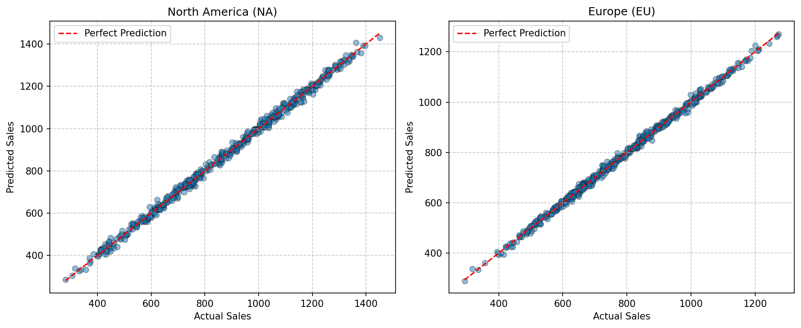

# Real-World Marketing Analysis Report

## 1. 模型系数估计

| Market | Intercept | TV | Radio | Social | Holiday | R² |
|--------|-----------|----|-------|--------|---------|----|
| NA | 48.1036 | 3.5075 | 3.4977 | 0.0021 | 26.6990 | 0.9970 |
| EU | 28.8605 | 1.5102 | 4.7987 | 1.2028 | 18.2465 | 0.9976 |

## 2. 联合假设检验 (H₀: TV=Radio=Social=0)

| Market | F-statistic | p-value | Conclusion (α=0.05) |
|--------|-------------|---------|---------------------|
| NA | 54450.3336 | 0.0000e+00 | Significant |
| EU | 68786.6881 | 0.0000e+00 | Significant |

## 3. 分析结论

- **北美市场**：拒绝原假设，TV/Radio/Social 广告预算对销售额有显著联合影响。
- **欧洲市场**：拒绝原假设，TV/Radio/Social 广告预算对销售额有显著联合影响。

## 4. 预测效果可视化

